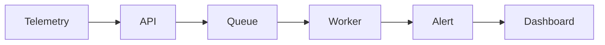
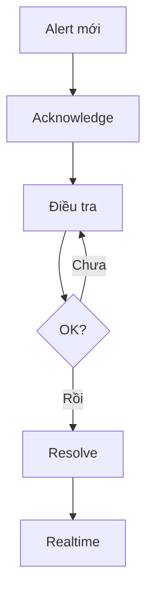

<p align="center">
  <h1 align="center">🛰️ SignalOps</h1>
  <p align="center">
    Hệ thống giám sát chất lượng mạng viễn thông theo thời gian thực
    <br />
    <a href="docs/ARCHITECTURE.md">Kiến trúc</a>
    ·
    <a href="docs/API.md">API</a>
    ·
    <a href="docs/DEPLOYMENT.md">Triển khai</a>
    ·
    <a href="docs/CONTRIBUTING.md">Đóng góp</a>
  </p>
</p>

<p align="center">
  
  
  
  
</p>

---

## Giới thiệu

**SignalOps** giải quyết bài toán **giám sát chất lượng mạng viễn thông** — thu thập dữ liệu telemetry từ các thiết bị mạng (latency, packet loss, signal strength), tự động phát hiện bất thường, tạo cảnh báo và cập nhật lên dashboard theo thời gian thực qua WebSocket.

### Dự án giải quyết vấn đề gì?

Hãy tưởng tượng bạn vận hành mạng viễn thông với hàng trăm trạm phát sóng rải khắp thành phố. Bạn cần biết ngay lập tức:

- 📡 Trạm nào **phản hồi chậm** (latency cao)?
- 📉 Trạm nào đang **mất gói dữ liệu** (packet loss)?
- 📶 Trạm nào **tín hiệu yếu** (signal strength thấp)?
- 🗺️ Vấn đề xảy ra ở **vị trí nào** trên bản đồ?

SignalOps tự động hóa toàn bộ quy trình: thu thập → phát hiện → cảnh báo → hiển thị.

---

## Luồng hoạt động

```
Thiết bị / Simulator
       │
       ▼
  API Gateway ──── WebSocket ────▶ Dashboard (Next.js)
    │
   Redis (BullMQ)
    │
    Worker ──────▶ MongoDB
```

| Bước | Mô tả | Thành phần |
|------|--------|-----------|
| 1 | Thiết bị gửi telemetry | Simulator / thiết bị thật |
| 2 | API Gateway nhận, validate, enqueue | API Gateway |
| 3 | Worker xử lý và phát hiện bất thường | Worker Service |
| 4 | Cảnh báo + realtime update | MongoDB / WebSocket / Dashboard |

---

## Quy trình xử lý cảnh báo

Khi dashboard hiện sự cố, quy trình xử lý được tách theo từng vai trò như sau:

### 1) Hệ thống



- 🛠️ **Hệ thống**: nhận dữ liệu từ thiết bị hoặc simulator, kiểm tra API key/rate limit, đẩy job vào Redis, rồi ghi event/alert vào MongoDB và bắn realtime lên dashboard

### 2) Operator

- 👨‍💻 **Operator**: mở chi tiết alert, xem thiết bị/vị trí/mức độ, bấm `Xác nhận cảnh báo` để ghi nhận đã tiếp nhận, điều tra nguyên nhân, rồi bấm `Đánh dấu đã xử lý` khi đã khắc phục xong

### 3) NOC

- 📟 **NOC**: theo dõi nhiều cảnh báo cùng lúc theo khu vực, ưu tiên theo severity, nhìn realtime để biết alert nào đã ack/resolved, và kiểm tra DLQ nếu job xử lý gặp lỗi

### Ví dụ xử lý thực tế

1. 09:10, trạm `bts-hcm-03` báo `signalStrength=-95 dBm` và `packetLoss=8.5%` sau khi mất backhaul.
2. API Gateway nhận telemetry, kiểm tra `x-api-key`, rồi đẩy job vào Redis.
3. Worker đọc job, vượt ngưỡng nên tạo alert `open` và lưu vào MongoDB.
4. Dashboard/NOC thấy alert đỏ ngay lập tức qua WebSocket.
5. Operator mở alert, bấm `Xác nhận cảnh báo`, nhập tên của mình để ghi `acknowledgedBy`.
6. Kỹ thuật viên kiểm tra trạm, khôi phục đường truyền backhaul và xác nhận chỉ số đã ổn.
7. Operator bấm `Đánh dấu đã xử lý`, thêm `resolutionNote`, alert chuyển sang `resolved` và các màn hình khác cập nhật realtime.



### Project hỗ trợ người xử lý như thế nào?

- Hiển thị chi tiết cảnh báo: thiết bị, vị trí, mức độ, thời gian tạo, người xác nhận, người xử lý
- Cho phép operator nhập tên khi `acknowledge` và khi `resolve`
- Lưu lại `acknowledgedBy`, `acknowledgedAt`, `resolvedBy`, `resolvedAt`, `resolutionNote`
- Chặn sai luồng trạng thái, ví dụ cảnh báo đã `resolved` thì không acknowledge lại được
- Đồng bộ realtime qua WebSocket để các màn hình khác thấy thay đổi ngay
- DLQ trong Settings giúp theo dõi các job lỗi nếu quá trình xử lý gặp vấn đề

---

## Các dịch vụ

| Dịch vụ | Vai trò | Cổng |
|---------|---------|------|
| **API Gateway** | Cổng tiếp nhận REST API, Swagger docs, WebSocket server | `:3000` |
| **Worker Service** | Xử lý nền, phát hiện bất thường, tạo cảnh báo | — |
| **Simulator** | Tạo dữ liệu telemetry mô phỏng từ thiết bị ảo | — |
| **Dashboard** | Giao diện Next.js: bản đồ, cảnh báo, biểu đồ | `:3001` |
| **MongoDB** | Lưu trữ events và alerts | `:27017` |
| **Redis** | Hàng đợi BullMQ + cache | `:6379` |
| **Nginx** | Reverse proxy (tùy chọn) | `:8080` |

---

## Công nghệ

**Backend:** NestJS · TypeScript · BullMQ · Socket.io · Winston  
**Dữ liệu:** MongoDB 7.0 · Redis 7.2  
**Frontend:** Next.js · React · Tailwind CSS · Leaflet · Recharts · Zustand  
**Hạ tầng:** Docker Compose · Jenkins · Nginx

## Phạm vi bản phát hành

**Trong phạm vi hiện tại:**
- Event ingestion pipeline: API Gateway → Redis queue → Worker
- Threshold-based alert generation và realtime dashboard
- REST API cho events, alerts, health, stats, devices
- Local orchestration bằng Docker Compose

**Ngoài phạm vi hiện tại:**
- IAM/multi-tenant auth production
- ML anomaly detection
- CI/CD hardening đầy đủ cho production rollout

**Tiêu chí thành công chính:**
- Service khởi động ổn định trong compose
- Event được nhận và xử lý bất đồng bộ
- Alert sinh ra đúng ngưỡng
- API truy vấn được dữ liệu events/alerts
- Realtime client nhận cập nhật ngay

---

## Bắt đầu nhanh

**Yêu cầu:** Node.js ≥ 18, Docker Desktop, npm

```bash
# Clone dự án
git clone https://github.com/lethien999/SignalOps.git
cd SignalOps

# Cài đặt dependencies
npm install

# Cấu hình môi trường
cp .env.example .env

# Chạy toàn bộ hệ thống
npm run docker:build
npm run docker:up
```

Kiểm tra hoạt động:

```bash
curl http://localhost:3000/api/health
# → { "status": "ok", "mongo": "connected", "redis": "connected" }
```

| Dịch vụ | URL |
|---------|-----|
| API Gateway | `http://localhost:3000` |
| Swagger UI | `http://localhost:3000/api/docs` |
| Dashboard | `http://localhost:3001` |
| Nginx proxy | `http://localhost:8080` |

---

## Giao diện Dashboard

Dashboard gồm 5 trang chính:

| Trang | Chức năng |
|-------|-----------|
| **Tổng quan** | Thẻ metric, bảng cảnh báo gần đây, sự kiện mới nhất, biểu đồ xu hướng |
| **Bản đồ** | Bản đồ Leaflet hiển thị vị trí thiết bị, tìm kiếm, chi tiết từng thiết bị |
| **Cảnh báo** | Quản lý toàn bộ cảnh báo: lọc, xác nhận, xử lý, **nhóm theo vị trí** |
| **Chỉ số** | Biểu đồ Latency, Packet Loss, Signal Strength, hiệu suất Worker |
| **Cài đặt** | Trạng thái kết nối, ngưỡng cảnh báo, thông tin hệ thống, gửi event thử |

**Tính năng mới:**
- 🌙 **Dark Mode** — Chuyển đổi sáng/tối với nút toggle trên header
- 📝 **Nhập tên operator** khi xác nhận/xử lý cảnh báo
- 📊 **Nhóm theo vị trí** — Xem cảnh báo gộp theo khu vực với badge đếm

---

## Ngưỡng cảnh báo

| Chỉ số | Điều kiện | Mức độ | Ý nghĩa |
|--------|-----------|--------|---------|
| Latency | > 200ms | 🔴 HIGH | Phản hồi chậm, ảnh hưởng trải nghiệm |
| Packet Loss | > 5% | 🔴 HIGH | Mất dữ liệu, cuộc gọi bị đứt |
| Signal Strength | < −90 dBm | 🟡 MEDIUM | Tín hiệu yếu, vùng phủ sóng kém |

Tất cả ngưỡng có thể cấu hình qua biến môi trường trong `.env`.

---

## API

```
POST   /api/events           Tạo sự kiện mới (trả 202 Accepted)
GET    /api/events            Danh sách sự kiện (phân trang, lọc theo deviceId, ngày)
GET    /api/events/:id        Chi tiết sự kiện

GET    /api/alerts            Danh sách cảnh báo (lọc theo severity, status)
GET    /api/alerts/:id        Chi tiết cảnh báo
GET    /api/alerts/history    Lịch sử cảnh báo theo ngày (?days=7)
PATCH  /api/alerts/:id        Cập nhật trạng thái (open → acknowledged → resolved)
POST   /api/alerts/batch      Batch xác nhận/xử lý nhiều cảnh báo

GET    /api/devices           Danh sách thiết bị (derive từ events)

GET    /api/health            Kiểm tra sức khỏe hệ thống (version, memory, deps)
GET    /api/stats             Thống kê tổng hợp
```

Tham khảo đầy đủ: [docs/API.md](docs/API.md)

## Tích hợp dữ liệu thực tế

Thiết bị hoặc hệ thống NMS chỉ cần gửi `HTTP POST /api/events` với JSON gồm `deviceId`, `location`, `metrics`.

Ví dụ tối giản:

```bash
curl -X POST http://localhost:3000/api/events \
  -H "Content-Type: application/json" \
  -H "x-api-key: <your-api-key>" \
  -d '{
    "deviceId": "bts-hcm-01",
    "location": { "lat": 10.77, "lng": 106.70, "name": "Trạm Q1 HCM" },
    "metrics": { "latency": 250, "packetLoss": 8, "signalStrength": -95 }
  }'
```

Xem chi tiết format và adapter mẫu tại [docs/API.md](docs/API.md).

---

## WebSocket (Realtime)

Kết nối tới `ws://localhost:3000` bằng Socket.io client.

| Event | Mô tả |
|-------|-------|
| `alert:new` | Cảnh báo mới được tạo |
| `alert:acknowledged` | Cảnh báo đã được xác nhận |
| `alert:resolved` | Cảnh báo đã được xử lý |
| `event:processed` | Sự kiện xử lý xong |
| `device:status:changed` | Thiết bị thay đổi trạng thái |
| `queue:depth` | Độ sâu hàng đợi (định kỳ) |
| `worker:stats` | Thống kê hiệu suất Worker |

---

## Cấu trúc dự án

```
SignalOps/
├── apps/
│   ├── api-gateway/         # Cổng HTTP + WebSocket
│   ├── worker-service/      # Xử lý nền + phát hiện bất thường
│   ├── simulator/           # Tạo dữ liệu telemetry mô phỏng
│   └── dashboard/           # Giao diện Next.js
├── libs/
│   ├── common/              # Tiện ích dùng chung, logger, constants
│   └── models/              # Schemas, DTOs, interfaces
├── infrastructure/
│   ├── docker-compose.yml   # Cấu hình production
│   ├── docker-compose.dev.yml # Cấu hình dev (hot reload)
│   ├── Dockerfile.*         # Dockerfile cho từng service
│   ├── nginx/               # Cấu hình reverse proxy
│   └── monitoring/          # Prometheus + Grafana config
├── scripts/                 # Backup, công cụ dev, xác minh API/WebSocket
├── Jenkinsfile              # CI/CD pipeline
└── docs/                    # Tài liệu kiến trúc, API, triển khai
```

## Quy ước Git

- Quy ước chi tiết: [docs/CONTRIBUTING.md](docs/CONTRIBUTING.md)
- Tóm tắt: mỗi feature/fix/hotfix phải có branch riêng, branch mới tách từ nhánh ổn định, và không commit trực tiếp lên `main`
- Commit cần rõ nghĩa theo kiểu `type(scope): summary`, tránh message chung chung

---

## Lệnh Docker

```bash
# Production (cần build lại khi sửa code)
npm run docker:build     # Build tất cả images
npm run docker:up        # Khởi động hệ thống
npm run docker:logs      # Xem logs
npm run docker:down      # Dừng hệ thống
```

---

## CI/CD (Jenkins)

[`Jenkinsfile`](Jenkinsfile) định nghĩa pipeline đầy đủ:

**Checkout → Install → Build → Lint → Test → Xác minh API → Kiểm tra logs → Docker Build & Tag**

- Chạy unit tests với yêu cầu coverage
- Khởi động hệ thống và xác minh API endpoints qua smoke tests
- Quét logs container tìm lỗi nghiêm trọng (FATAL, OOM, unhandled rejections)
- Tag Docker images với commit SHA trên nhánh `main`

---

## Giám sát (Monitoring)

```bash
# Khởi động Prometheus + Grafana + Node Exporter
docker compose -f infrastructure/monitoring/docker-compose.monitoring.yml up -d
```

| Dịch vụ | URL |
|---------|-----|
| Prometheus | `http://localhost:9090` |
| Grafana | `http://localhost:3003` (admin/signalops2026) |
| Node Exporter | `http://localhost:9100` |

---

## Bảo mật

- **API Key**: Đặt biến `API_KEY` trong `.env` → mọi request POST cần header `x-api-key`
- **Rate Limiting**: Giới hạn 100 req/phút/IP (cấu hình qua `RATE_LIMIT_MAX`)
- **Correlation ID**: Mỗi request được gán UUID duy nhất trong header `x-correlation-id`
- **Env Validation**: Kiểm tra biến môi trường bắt buộc khi khởi động

---

## Kiểm thử

```bash
# Unit tests
npm test

# Xác minh API endpoints
npm run verify:api

# Xác minh WebSocket
npm run verify:websocket
```

Kiểm tra thủ công:

```bash
curl -X POST http://localhost:3000/api/events \
  -H "Content-Type: application/json" \
  -d '{
    "deviceId": "device-01",
    "location": { "lat": 10.77, "lng": 106.70, "name": "HCM-Tower-1" },
    "latency": 250,
    "packetLoss": 8,
    "signalStrength": -95
  }'
```

---

## Tài liệu

| Tài liệu | Nội dung |
|-----------|----------|
| [ARCHITECTURE.md](docs/ARCHITECTURE.md) | Thiết kế hệ thống và luồng dữ liệu |
| [API.md](docs/API.md) | Tham khảo REST API & WebSocket |
| [OPERATIONS.md](docs/OPERATIONS.md) | Quy trình vận hành và xử lý cảnh báo |
| [DEPLOYMENT.md](docs/DEPLOYMENT.md) | Hướng dẫn triển khai & rollback |
| [CONTRIBUTING.md](docs/CONTRIBUTING.md) | Quy trình phát triển & quy tắc |

---

## Giấy phép

[MIT](LICENSE) © 2026 Lê Anh Thiện
